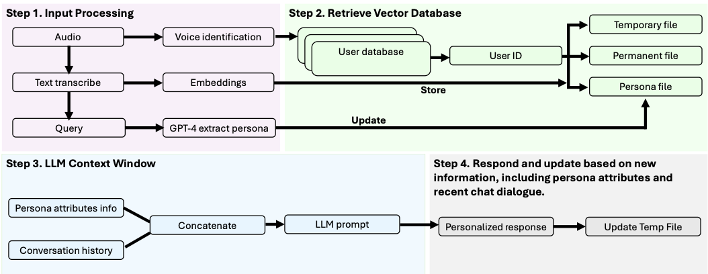
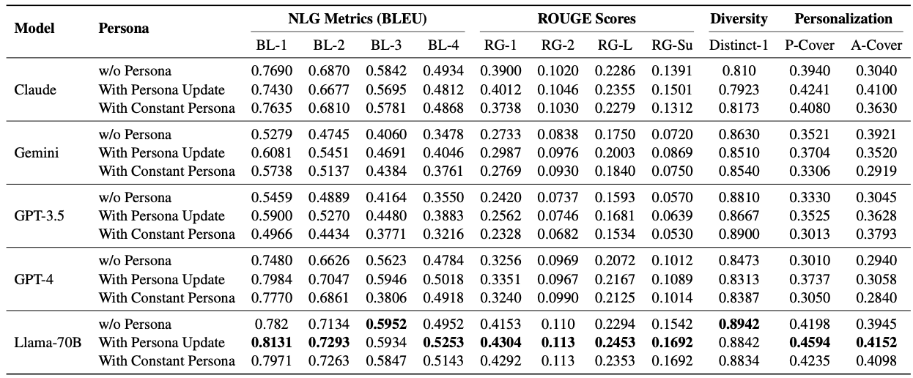

# PAT

This framework outlines the creation of the PAT dataset to enhance LLMs with personality-driven responses. It extracts personas from the MSC dataset using ChatGPT4, then employs Meta's LLAMA 405B to generate personalized scenes and questions. These structured prompts produce AI-human dialogues, to continuously expand the PAT dataset.

## Adaptive Friend Agent (AFA)

This framework takes in audio input, transcribes it to text, and uses it for voice identification. It then extracts relevant persona attributes and retrieves user data from a vector database. Tt combines persona details with conversation history, and creates a context-aware prompt for the LLM to generate a personalized response. Finally, the system updates temporary records to improve future interactions, to establish a more adaptive and engaging experience.
## Evaluation Results

The table shows that persona integration improves LLM performance, with Llama-70B, fine-tuned with the Personalized Agent Chat (PAT) dataset, outperforming Claude, Gemini, GPT-3.5, and GPT-4 in BLEU-1 (0.8131), ROUGE-1 (0.4304), and personalization scores (P-Cover: 0.4594, A-Cover: 0.412). It also maintains higher diversity (0.894) while balancing persona consistency better than larger models.
