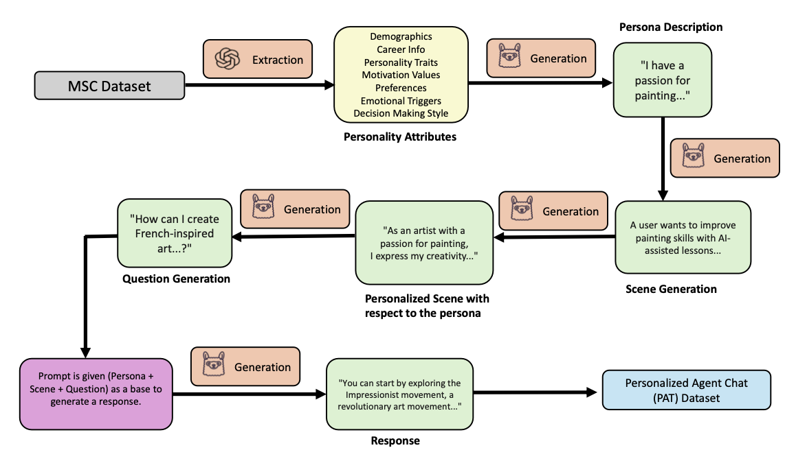

# PAT

## Adaptive Friend Agent (AFA)

This framework takes in audio input, transcribes it to text, and uses it for voice identification. It then extracts relevant persona attributes and retrieves user data from a vector database. Tt combines persona details with conversation history, and creates a context-aware prompt for the LLM to generate a personalized response. Finally, the system updates temporary records to improve future interactions, to establish a more adaptive and engaging experience.

